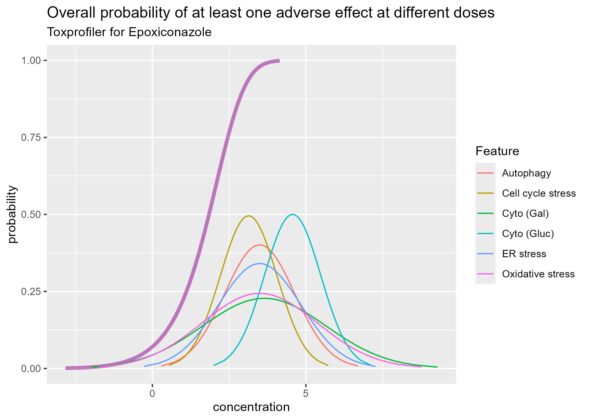
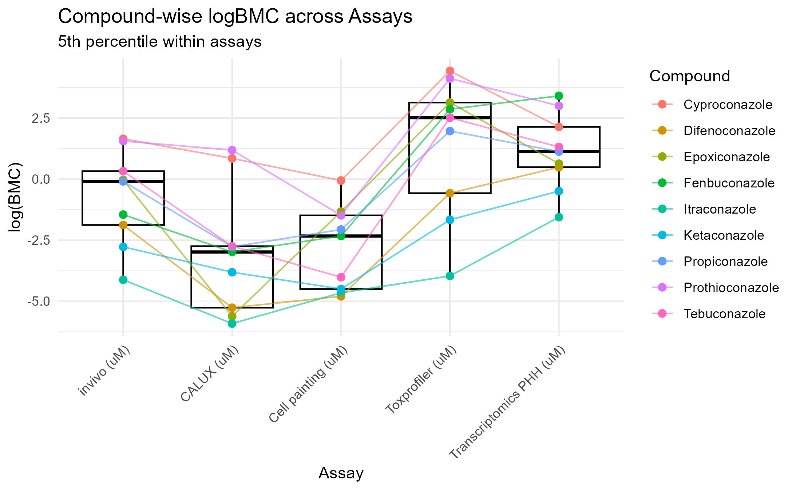
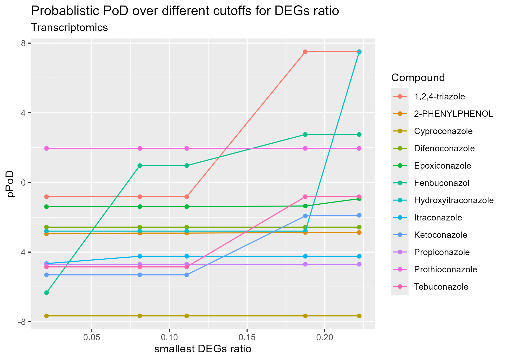

# Probabilistic Point-of-Departure Analysis

This repository contains selected R code and example figures from an
exploratory collaborative research project on the uncertainty-aware integration
of in vitro toxicology data.

The project investigated how benchmark concentration estimates from multiple
biological features and assays could be combined to derive a probabilistic
Point of Departure (pPoD).

This repository is intended as a portfolio overview of the analytical work.
It is not a complete reproducibility package.

## Project overview

The analysis considered benchmark concentration estimates from several
in vitro assays, including:

- ToxProfiler
- Cell Painting
- Transcriptomics
- CALUX

Feature-level benchmark concentration uncertainty was represented on the
log-concentration scale and aggregated using the probability of observing at
least one measured response at a given concentration.

A probabilistic Point of Departure was then obtained by identifying the
concentration corresponding to a selected probability threshold.

## Repository contents

- `selfmade_functions.R`  
  Reusable R functions for calculating aggregated concentration-response
  probabilities, deriving probabilistic Points of Departure, and producing
  visualisations.

- `transcript.qmd`  
  Selected transcriptomics analysis and sensitivity analysis using different
  DEG-ratio inclusion thresholds.

- `figures/`  
  Three representative outputs from the project.

Raw data, intermediate datasets, and fitted model objects are not included
because the work was conducted as part of a collaborative research project.

## Selected results

### Aggregated probability of a measured response

The coloured curves represent feature-specific response probabilities for
Epoxiconazole in the ToxProfiler assay. The thicker curve represents the
aggregated probability of observing at least one measured response.

### Comparison across assays

This figure compares compound-specific benchmark concentration estimates
across several in vitro assays and available in vivo reference values.

### Transcriptomics sensitivity analysis

This analysis evaluates how transcriptomics-based probabilistic Points of
Departure change when features with lower DEG ratios are excluded.

## Methods demonstrated

The selected materials demonstrate:

- data harmonisation across toxicological assays;
- uncertainty quantification for benchmark concentrations;
- probabilistic aggregation across biological features;
- probabilistic Point-of-Departure estimation;
- comparison of compound-specific results across assays;
- sensitivity analysis;
- reproducible analysis using R and Quarto;
- scientific visualisation using `ggplot2`.

## Data availability

The original datasets are not publicly available through this repository.

Only selected analytical code and representative figures are provided.
Some analyses used empirical uncertainty bounds, while illustrative uncertainty
values were used for assays where complete uncertainty information was not
available.

The materials should therefore be interpreted as an exploratory methodological
implementation rather than a validated toxicological risk assessment.

## My contribution

My contribution included:

- harmonising data from multiple in vitro assays;
- implementing R functions for probabilistic feature aggregation;
- calculating uncertainty-aware probabilistic Points of Departure;
- comparing assay- and compound-specific estimates;
- conducting sensitivity analyses;
- creating analytical visualisations and Quarto reports.

## Acknowledgements

This work was conducted as part of a collaborative research project.
The repository contains only selected materials suitable for portfolio
presentation. Data, methodological input, and domain expertise were provided
by the wider project team.
